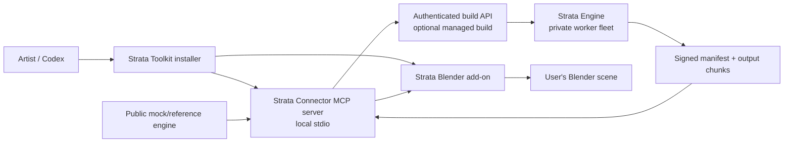
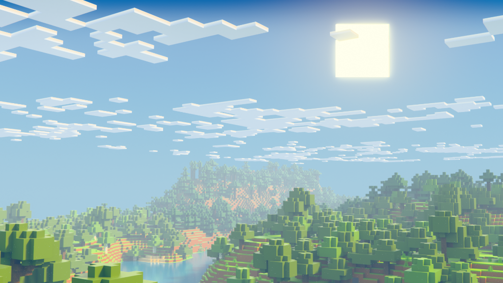
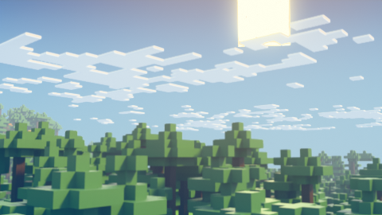
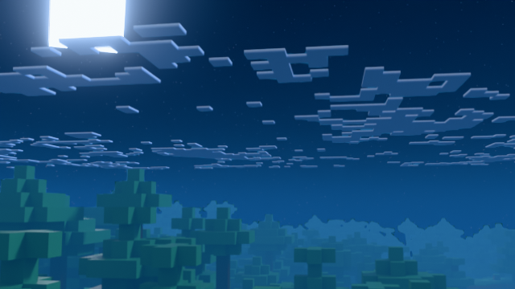
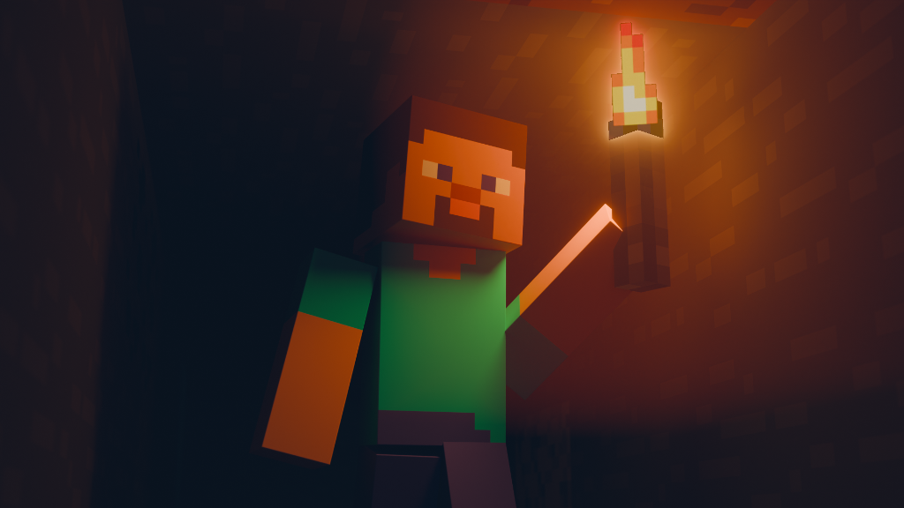

# Strata Toolkit

**AI-native Blender integration for cinematic Minecraft world production.**

[](https://github.com/KaartikeyKusshwaha/Strata-Connector)
[](https://www.gnu.org/licenses/gpl-3.0)
[](https://www.python.org/downloads/)
[](https://www.blender.org/download/)
[](http://makeapullrequest.com)

Strata Toolkit is a professional, AI-native production toolchain that transforms Minecraft Java worlds into optimized, render-ready Blender scenes. It consists of a **public Connector** (this repository) and an optional **private production Engine** that handles the heavy-lifting of world ingestion, asset resolution, and chunk planning.

> **Important**: This repository contains the public Strata Connector — the Blender add-on, local MCP server, versioned data contracts, reference engine, and test infrastructure. The production engine that performs world parsing, culling, and 3D chunk planning is a separate private service. You do not need the private engine to develop, test, or contribute to the Connector.



---

## Two Build Modes

| Mode | What happens | Who uses it |
| --- | --- | --- |
| **Managed build** | After explicit consent, the Connector uploads your world and declared assets to the private Strata Engine. The Engine returns signed output artifacts and diagnostics. | Artists wanting production-quality results |
| **Developer/test build** | The Connector talks to the included reference engine with synthetic fixtures. No account, private assets, or production Engine access needed. | Contributors, CI, protocol development |

---

## What's in This Repository

| Directory | Purpose |
| --- | --- |
| `addon/` | Blender add-on: UI, chunk paging, session-authenticated bridge |
| `connector_mcp/` | Local stdio MCP server with 12 named tools |
| `contracts/` | Versioned Pydantic v2 schemas for requests, status, manifests, errors |
| `reference_engine/` | Deterministic mock engine for protocol testing |
| `installer/` | Signed installer metadata and compatibility checks |
| `tests/` | Unit, contract, security, MCP, bridge, and E2E tests |
| `docs/` | Setup, privacy, protocol, architecture, troubleshooting |
| `scripts/` | Release audit and CI tooling |

## What's NOT in This Repository

- Private Engine source code (world parsing, culling, chunk planning, asset resolution)
- Production reference profiles or private test worlds
- API keys, signing keys, or cloud credentials
- Minecraft JAR contents, textures, or third-party asset packs
- Arbitrary code execution endpoints

---

## Showcase

### Large World Import

Strata handles entire Minecraft world regions, chunking them for efficient viewport performance while keeping the full scene render-ready.

### Responsive Viewport

Dense forests stay interactive through chunk-based visibility toggling. Load what you need, hide what you don't.

### Night Cinematic

Production-ready lighting with real geometry — every block is a real 3D object with proper materials.

### Sky and Atmosphere

Full artistic control over volumetric clouds, atmospheric scattering, and time-of-day lighting per chunk.

### Character and Lighting

Cinematic lighting with torch glow, ambient occlusion, and depth — ready for animation.

---

## MCP Tools

The Connector exposes 12 named MCP tools for AI-assisted workflows:

| Tool | Function | Mutating |
| --- | --- | --- |
| `strata_preflight_world` | Validate world layout and show capability/privacy report | No |
| `strata_inspect_library` | Inspect a block library's metadata | No |
| `strata_generate_barebones_library` | Generate a legal procedural fallback library in Blender | Yes |
| `strata_submit_managed_build` | Submit consented inputs to the Engine | Yes |
| `strata_get_job_status` | Retrieve structured job progress | No |
| `strata_download_result` | Download and verify signed artifacts | Yes |
| `strata_open_result_in_blender` | Open verified result in Blender | Yes |
| `strata_get_chunk_streaming_status` | Read loaded chunk state | No |
| `strata_load_chunk_radius` | Change visible working set | Yes |
| `strata_set_interactive_block_state` | Change a block-only state | Yes |
| `strata_keyframe_interactive_block_state` | Keyframe a block-only state | Yes |
| `strata_pair_blender` | Complete Blender bridge pairing or query status | No |

---

## Quick Start

### For Contributors

```bash
git clone https://github.com/KaartikeyKusshwaha/Strata-Connector.git
cd Strata-Connector
python -m venv .venv
pip install -e ".[dev]"
pytest tests -q --basetemp=.pytest_cache/test-tmp
```

### For Artists (Windows release install)

1. Download the ZIP and matching `.sha256` file from the [GitHub release](https://github.com/KaartikeyKusshwaha/Strata-Connector/releases).
2. Verify the archive hash, extract it, and run the installer from PowerShell:

   ```powershell
   Set-Location "$env:USERPROFILE\Documents\Strata-Connector-v1.1.1"
   $installDir = Join-Path $env:LOCALAPPDATA 'Strata'
   $addonsDir = Join-Path $env:APPDATA 'Blender Foundation\Blender\4.5\scripts\addons'
   py -3.13 -m installer.install `
     --install-dir $installDir `
     --blender-addons-dir $addonsDir `
     --register-codex `
     --json
   codex plugin marketplace add "$installDir\codex-marketplace"
   codex plugin add strata-toolkit@strata-local
   ```

3. Restart Codex, enable **Strata Toolkit** in Blender, start the Strata
   bridge, and complete nonce pairing from the Strata panel.
4. Follow the [complete clean-device guide](docs/LIVE_DEVICE_TEST_SETUP.md)
   for the checksum check, tool sequence, uninstall command, and troubleshooting.
5. For real world conversion, configure `STRATA_API_MODE=http` with a
   reachable authenticated private Engine. Without it, output is explicitly
   synthetic fixture data and is not a Minecraft conversion.

---

## Compatibility

| Component | Supported Versions |
| --- | --- |
| **Operating System** | Windows 10/11 x64 |
| **Python** | 3.10, 3.11, 3.12, 3.13 |
| **Blender** | 4.5 LTS or later |
| **Connector** | 1.0.0+ |
| **Contract Version** | 1.0 |
| **Engine** | 2026.09.0+ (managed builds only) |

---

## Documentation

| Guide | Description |
| --- | --- |
| [Setup](docs/SETUP.md) | Installation and configuration |
| [Quick Start](docs/QUICKSTART.md) | First import walkthrough |
| [Architecture](docs/ARCHITECTURE.md) | Two-component design and protocol |
| [Workflows](docs/WORKFLOWS.md) | Production workflow patterns |
| [Chunks](docs/CHUNKS.md) | 3D A1 chunk naming and streaming |
| [Asset Libraries](docs/ASSET_LIBRARIES.md) | Texture precedence and library authority |
| [Animation](docs/ANIMATION.md) | Block-only interactive rigs |
| [Compatibility](docs/COMPATIBILITY.md) | Version support matrix |
| [Roadmap](docs/ROADMAP.md) | Planned features |
| [Security](SECURITY.md) | Vulnerability reporting |
| [Contributing](CONTRIBUTING.md) | How to contribute |
| [Convergence Plan](docs/PUBLIC_CONNECTOR_AND_ENGINE_PLAN.md) | Two-repository architecture plan |

---

## Contributing

See [CONTRIBUTING.md](CONTRIBUTING.md) for guidelines. For security issues, see [SECURITY.md](SECURITY.md).

## License

GPL-3.0-or-later. See [LICENSE](LICENSE) for details.
