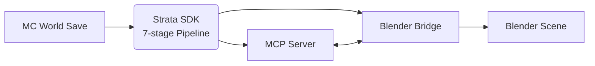
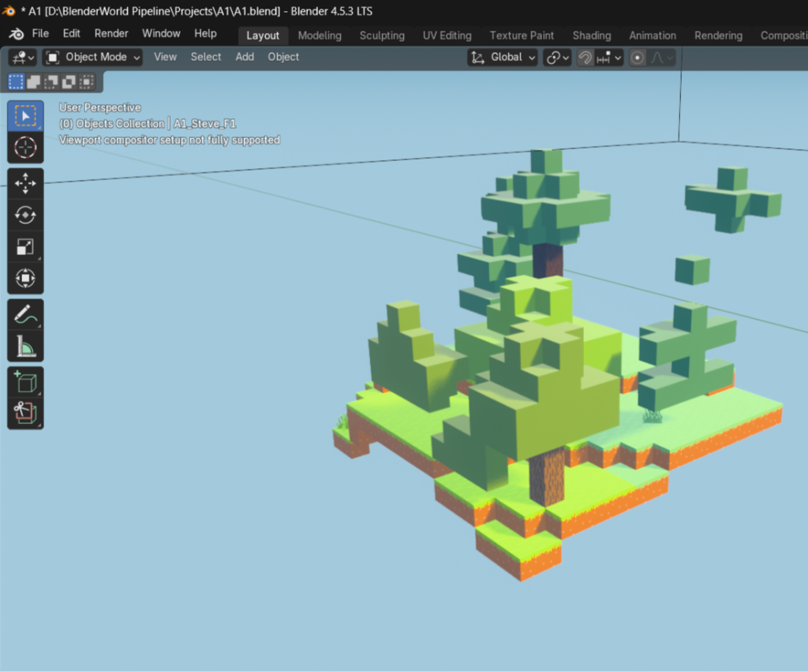
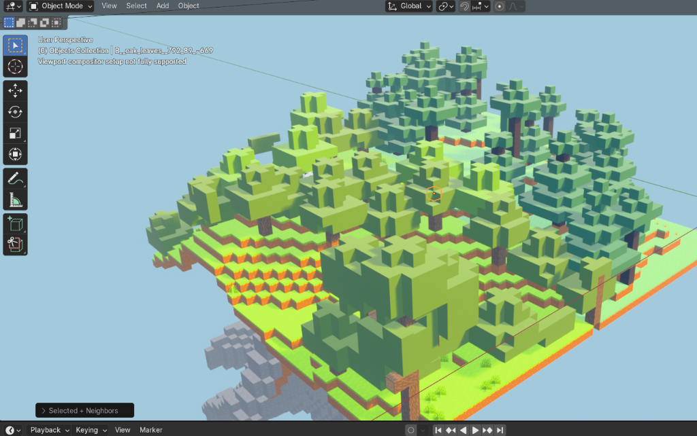
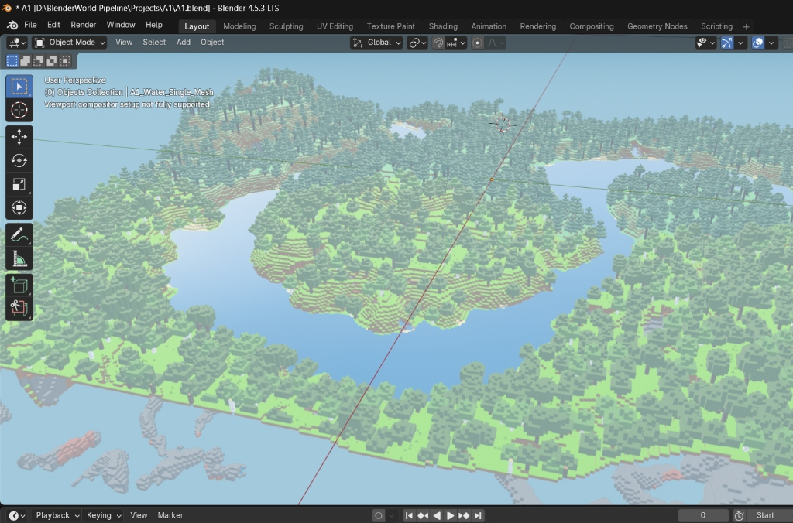
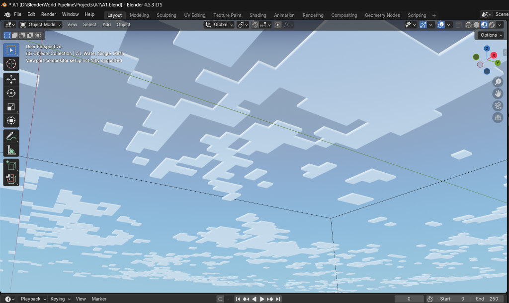
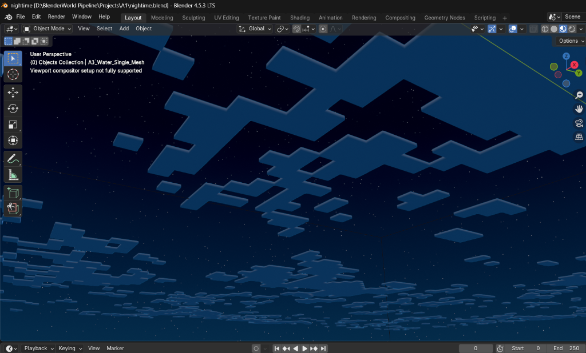
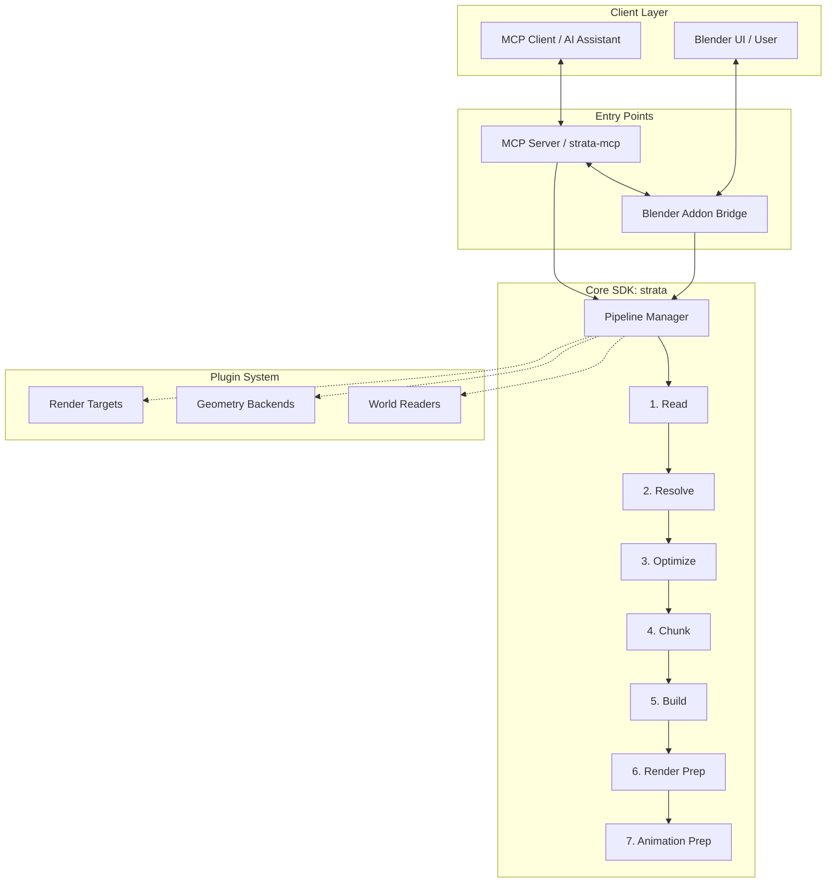

# Strata

**AI-native production pipeline for Blender.**

Strata is a professional, AI-native production pipeline designed specifically for Blender. It seamlessly translates massive, complex Minecraft worlds into optimized, render-ready cinematic scenes. By encapsulating deep production knowledge into a reusable software SDK, Strata eliminates repetitive scripts and prompts. The pipeline is fully integrated with a Model Context Protocol (MCP) server, allowing AI assistants to drive Blender directly, executing highly complex 3D workflows through natural language.

---

## Current Capabilities

Strata v1.0.0 is a complete, production-grade Minecraft-to-Blender pipeline that reconstructs Java 1.21+ Minecraft worlds inside Blender while keeping working memory strictly bounded.

### Individual Chunk

A reconstructed Minecraft chunk inside Blender. Every block remains a real, selectable Blender object or instance, allowing artists to inspect, edit, replace, or animate individual elements.

### Chunk Groups

Multiple 3D chunks reconstructed together using A1 collection hierarchy (`Chunk_xp001_ym002_zp003`).

### Full World Reconstruction

Large Minecraft environments exported as an external directory scene (`World.blend`, `strata-world-manifest.json`, and `chunks/Chunk_*.blend`) with LRU working-set streaming.

### Procedural Blocky Clouds & Atmosphere

Procedural Minecraft-style blocky cloud layers, atmospheric height fog, HDRI sky preservation, and visible sun mesh with independent directional lighting.

### Procedural Water Bodies

Production-quality water surfaces with mode-aware shading (day/night ocean turquoise vs midnight navy) and noise-driven ripple normals.

---

## What v1.0.0 Delivers

Strata v1.0.0 delivers a complete, memory-bounded, production-ready pipeline for Blender:

- **SQLite WorldStore Streaming**: Disk-backed database storage in `%LOCALAPPDATA%\Strata\work\`, streaming blocks in 5,000-block transactions with SQL 6-neighbor hidden-block culling.
- **A1-Compatible 3D Chunk Identities**: 3D chunk keys (`Chunk_xp001_ym002_zp003`), Blender `(X,Z,Y)` coordinate mapping, and custom properties (`mc_chunk_size`, `mc_chunk_x`, `mc_chunk_y`, `mc_chunk_z`, `mc_kind`, `mc_object_count`, `minecraft_chunk`).
- **Asset Library Authority & Texture Stack**: Strict precedence chain (`user_texture_packs` $\rightarrow$ `selected_texture_packs` $\rightarrow$ `minecraft_jar`) with SHA-256 verification and non-block asset filtering.
- **Own-Library Generator**: Java 1.21 blockstate and parent model inheritance JSON parser resolving texture maps and normalized Z-up unit box templates.
- **External Directory Output & Manifest**: Scene directory export (`World.blend`, relative `chunks/Chunk_*.blend` files, and `strata-world-manifest.json`).
- **LRU Edit-Time Streaming Engine**: 27-chunk 3D working set streaming engine with chunk pinning, unpinned unloading, and static mesh duplication operators (`Make Selected Static Mesh Unique`).
- **Block-Only Interactive Motion Rigs**: Unique keyframeable armatures for chests, doors, trapdoors, fence gates, barrels, shulker boxes, pistons, and beds driven by `strata_open` ($0.0 \rightarrow 1.0$) properties.
- **FastMCP Server Tools Suite**: Full MCP server integration (`preflight_minecraft_world`, `import_minecraft_world`, `get_chunk_streaming_status`, `load_chunk_radius`, `set_interactive_block_state`, `keyframe_interactive_block_state`).

---

## Architecture

---

## Quick Start

### For Creators
1. Install the Blender addon via `scripts/install_addon.py` or zip file.
2. Open Blender 4.0+.
3. In the 3D Viewport side panel (press `N`), locate the **Strata** tab.
4. Click **Start Bridge Server** to open the socket on port `:9877`.
5. Install the MCP server: `pip install -e .`
6. Run `strata-mcp` or connect your AI assistant (e.g. Claude Desktop / Antigravity settings).
7. Ask your AI assistant to: "Import the Minecraft world at `C:/path/to/saves/MyWorld`".

### For Developers
1. Clone the repository: `git clone https://github.com/KaartikeyKusshwaha/Strata.git`
2. Install in editable mode: `pip install -e ".[dev]"`
3. Run the pure-Python test suite: `pytest`
4. Run the Blender background integration tests: `blender --background --factory-startup --python scripts/run_blender_tests.py`

---

## User Instructions & Documentation Links

Detailed documentation across the `docs/` directory:

- **[Installation & Setup Guide (`docs/SETUP.md`)](docs/SETUP.md)**: Addon installation, directory structure, and `strata-mcp` settings.
- **[Quickstart Guide (`docs/QUICKSTART.md`)](docs/QUICKSTART.md)**: 10-minute guide to importing world saves and rendering scenes.
- **[3D Chunks & LRU Paging (`docs/CHUNKS.md`)](docs/CHUNKS.md)**: A1 3D chunk identities, external `chunks/` files, working set streaming, and `strata-world-manifest.json`.
- **[Asset Library Authority & Texture Stack (`docs/ASSET_LIBRARIES.md`)](docs/ASSET_LIBRARIES.md)**: Precedence chain, Java model parser, and missing asset policies.
- **[Interactive Block Rigs (`docs/ANIMATION.md`)](docs/ANIMATION.md)**: Block-only motion armatures, `strata_open` drivers, and keyframing.
- **[Production Workflows (`docs/WORKFLOWS.md`)](docs/WORKFLOWS.md)**: Complete guide to water, clouds, environment lighting, and large world management.
- **[Architecture Deep-Dive (`docs/ARCHITECTURE.md`)](docs/ARCHITECTURE.md)**: "Two doors, one pipeline" design and bridge socket protocol.
- **[Contributing Guide (`CONTRIBUTING.md`)](CONTRIBUTING.md)**: Code style, PR guidelines, and testing.

---

## Contributing
We welcome contributions! Please see [`CONTRIBUTING.md`](CONTRIBUTING.md) for details.

## License
Strata is released under the [GNU General Public License v3.0](LICENSE). See [NOTICE](NOTICE) for authorship details.
