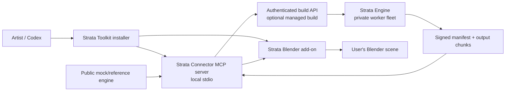

# Strata Architecture

## 1. Overview & Product Model

Strata Toolkit is architected around a clean separation between the user-installed integration layer (**Strata Connector**) and the production build service (**Strata Engine**).

For full details on this convergence, see the [Strata Connector and Engine Plan](PUBLIC_CONNECTOR_AND_ENGINE_PLAN.md).

The user sees **one cohesive product: Strata Toolkit**. The two repositories represent an architectural and packaging boundary:

| Repository | Visibility | Role & Scope |
| --- | --- | --- |
| **`Strata-Connector`** (this repository) | **Public** | Blender add-on, local stdio MCP server, versioned data contracts, reference engine, artifact verification, chunk streaming client, docs, and test suite. |
| **`Strata-Engine`** | **Private** | Anvil parsing, SQLite WorldStore, hidden-block culling, 3D A1 chunk planning, Java blockstate/model resolution, reference profiles, and headless Blender build workers. |

---

## 2. Public Connector Architecture

The public repository contains four primary components:

### 2.1 Contracts (`contracts/`)
The shared integration point. Versioned Pydantic v2 schemas:
- `BuildRequest`: Requested build configuration and input content hashes.
- `BuildConsent`: Transparent summary of declared files, hashes, and retention policy presented for user consent.
- `BuildStatus`: Status, progress, output URLs, and structured diagnostics.
- `ArtifactManifest` & `ChunkDescriptor`: Signed manifest with input hashes, chunk locations, and output SHA-256 checksums.
- `StreamingStatus`: Live Blender chunk loading state.
- `StrataError`: Sanitized, agent-safe structured error codes.

### 2.2 Local MCP Server (`connector_mcp/`)
A thin, agent-native FastMCP server running over `stdio`:
- Exposes 10 strict named tools (`strata_preflight_world`, `strata_submit_managed_build`, `strata_download_result`, etc.).
- Implements path traversal defense and input size validation.
- Validates signed manifest signatures and SHA-256 checksums before handing artifacts to Blender.
- Sanitizes error outputs to prevent credential or server path leakage.

### 2.3 Blender Add-on & Bridge (`addon/`)
The in-Blender UI and localhost bridge:
- **Session Capability Tokens**: Ephemeral tokens generated on bridge startup prevent unauthorized local connections.
- **Chunk Paging**: Viewport visibility toggling and memory-bounded working sets.
- **Interactive Rig Controls**: State drivers for animated interactive block rigs.

### 2.4 Reference Engine (`reference_engine/`)
A deterministic, lightweight mock server for offline development, protocol conformance, and CI:
- Produces synthetic, legally compliant manifests and chunk files.
- Simulates success, failure, cancellation, bad checksums, and version mismatch scenarios without requiring access to private engine infrastructure or copyrighted assets.

---

## 3. Communication Protocol

1. **Preflight & Consent**:
   - Connector calls `strata_preflight_world` to compute input file hashes and generate a `BuildConsent` report.
   - User explicitly reviews file list, intended use, and data retention policy.
2. **Managed Build**:
   - `strata_submit_managed_build` submits hashed inputs to the private Engine.
   - Engine processes chunks in headless Blender workers and publishes signed artifacts with `strata-world-manifest.json`.
3. **Download & Verify**:
   - Connector downloads the artifacts.
   - `manifest_validator` checks the manifest signature, validates all file checksums, and verifies no paths escape the output directory.
4. **Blender Hand-off**:
   - Connector sends verified manifest path to Blender add-on via token-authenticated bridge.
   - Blender streams and links chunks into the scene collection.

---

## 4. Security & Safety Principles

- **Zero Arbitrary Execution**: No `eval`, `exec`, shell execution, or dynamic Python scripting via MCP or bridge.
- **Path Traversal Defense**: All input/output paths are strictly validated to prevent directory traversal.
- **Zero Asset Redistribution**: No proprietary Minecraft textures, JARs, or third-party asset libraries are distributed in this repository.
- **Hard Boundary**: Public connector modules never import private engine modules.
