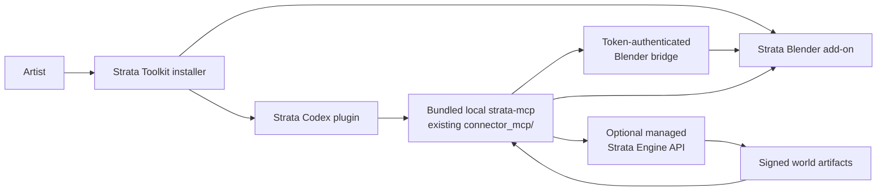

# Strata Toolkit: Codex plugin, MCP, and Blender plan

Status: implementation plan. This plan turns the existing Strata Connector
into one installable **Strata Toolkit** experience for Codex: a Codex plugin
that bundles the existing local MCP connector and connects it to the existing
Blender add-on. It does not replace either component or create a second world
pipeline.

> **Status note:** This plan is retained as architecture history. The current
> local plugin package uses the validated root `plugin.json`, bundled local
> stdio MCP declaration, installer-generated marketplace entry, and the
> 12-tool contract. Follow [LIVE_DEVICE_TEST_SETUP.md](LIVE_DEVICE_TEST_SETUP.md)
> for the executable setup flow; the private Engine is still required for a
> real Minecraft conversion.

## 1. Product outcome

An artist installs **Strata Toolkit** once, enables the Strata add-on in
Blender, and installs/enables the Strata plugin in Codex. In a new Codex chat,
the agent can use Strata's named MCP tools to preflight a world, obtain consent
before a managed build, track it, verify the result, and work with chunked
output in the live Blender session.



The plugin is a distribution and guidance layer. The MCP server remains the
only agent-tool interface; the Blender add-on remains the only component that
performs live Blender actions.

## 2. Fixed decisions

1. **One user-facing product, three cooperating components.** The installer,
   plugin, MCP connector, and Blender add-on are branded and versioned as
   Strata Toolkit.
2. **No second implementation.** The plugin calls the existing
   `connector_mcp` server. It must never embed the private Engine or duplicate
   world conversion, asset resolution, chunk planning, or Blender operators.
3. **Public Connector / private Engine split stays intact.** The plugin ships
   only public Connector code, contracts, safe instructions, and test
   fixtures. It never ships Engine code, production reference data, customer
   files, credentials, or signing private keys.
4. **MCP first, plugin second.** Finish and test the MCP connector before
   packaging it as a plugin. This follows OpenAI's plugin guidance for plugins
   that bundle an MCP server.
5. **No generic automation escape hatch.** Do not add `execute_python`,
   `eval`, `exec`, shell execution, raw bridge requests, arbitrary URL fetches,
   or unrestricted filesystem tools merely to make the plugin more flexible.
6. **Consent before transfer or mutation.** Uploading a world/assets, opening
   a result, saving a `.blend`, changing chunk residency, and keyframing a
   block are explicit mutating operations. Tool descriptions and the skill
   must make that visible.

## 3. What exists today

`Strata-Connector` already provides the pieces the plugin will use:

| Existing area | Current role in the plugin product |
| --- | --- |
| `connector_mcp/server.py` | Local FastMCP server with 12 named Strata tools |
| `connector_mcp/api_client.py` | Managed-build client boundary; currently development/reference behavior must be replaced before a production service claim |
| `connector_mcp/bridge_client.py` | Local token-authenticated bridge client |
| `addon/bridge_auth.py` | Per-session Blender bridge capability-token primitives |
| `contracts/` | Versioned public request, status, diagnostic, and artifact schemas/fixtures |
| `reference_engine/` | Public deterministic test/reference implementation |
| `installer/` | The correct home for a one-install user setup flow |

The existing public MCP tools are the initial plugin surface:

```text
strata_preflight_world
strata_inspect_library
strata_generate_barebones_library
strata_submit_managed_build
strata_get_job_status
strata_download_result
strata_open_result_in_blender
strata_get_chunk_streaming_status
strata_load_chunk_radius
strata_set_interactive_block_state
strata_keyframe_interactive_block_state
strata_pair_blender
```

Do not rename or remove tools casually once plugin releases exist. Add a
contract version and deprecation period for any breaking change.

## 4. Target plugin package

Create a dedicated package source directory in the public repository:

```text
codex_plugin/
├── .codex-plugin/
│   └── plugin.json                 # generated/validated native plugin manifest
├── .mcp.json                       # bundled MCP declaration
├── skills/
│   └── strata-toolkit/
│       └── SKILL.md                # workflow routing and consent rules
├── README.md                       # install, scope, supported versions
└── assets/                         # icon/screenshots only; no Minecraft assets
```

The release process stages this directory as the plugin root, named
`strata-toolkit`. Keep it separate from the Python source directories so the
plugin manifest never accidentally packages private developer files, tests,
or user assets.

Use the official plugin scaffolding flow to generate and validate the actual
`.codex-plugin/plugin.json` and MCP declaration at implementation time. Do
not hand-invent unsupported manifest fields in advance. The manifest must:

- use stable kebab-case naming and a version synchronized with the Connector
  compatibility policy;
- identify Strata as the developer and describe its Blender/MCP purpose;
- point only to the bundled `skills/` and registered Strata MCP server;
- list no hooks in v1;
- declare no external app or browser permission until it is genuinely needed.

## 5. The bundled MCP server

The plugin's MCP declaration launches the existing `strata-mcp` local stdio
entry point from `connector_mcp.server:main`. The plugin must not make a user
manually run `codex mcp add` after installing it; installation should register
the bundled server through the plugin mechanism.

### 5.1 Launcher requirement

The command in the release plugin must be a Strata-controlled launcher, not a
bare `python`, a mutable Git checkout path, or a globally resolved package that
could point to another version. The Windows installer must install:

- the matching Connector runtime in an isolated application directory;
- a small launcher that starts the exact packaged `strata-mcp` runtime;
- the plugin package referencing that launcher;
- the Blender add-on version compatible with that runtime.

During developer testing, a local marketplace may use an editable launch
command. It must be clearly marked development-only and must not be copied
into release instructions.

### 5.2 Tool approval policy

Use conservative defaults:

- read-only preflight, inspection, job-status, and streaming-status tools can
  use normal tool approval;
- submit/upload, download, open-in-Blender, chunk loading, state changes, and
  keyframing require user approval by default;
- the plugin documentation explains how a user can further restrict enabled
  tools in Codex configuration.

No token, OAuth credential, session capability token, or user file path should
be placed in the plugin skill text or committed to the repository.

## 6. Plugin skill: workflow orchestration, not hidden engine logic

Add one focused public skill: `strata-toolkit`.

Its trigger describes exactly when to use it: requests to inspect, import,
build, open, stream, or animate a Minecraft world with Strata in Blender.
Its instructions must perform this sequence:

1. Confirm Strata MCP availability and the intended local project/output
   directory.
2. Use `strata_preflight_world`; summarize supported data, estimated work,
   missing assets, and privacy implications.
3. If a custom library is involved, use `strata_inspect_library` and show the
   mapping/diagnostic implications before build submission.
4. Before `strata_submit_managed_build`, tell the user precisely which selected
   world and assets will leave the device, why, and the stated retention
   behavior. Require an explicit confirmation in the conversation.
5. Poll `strata_get_job_status` only as needed; report actionable changes and
   do not invent progress.
6. Call `strata_download_result`, then `strata_open_result_in_blender` only
   after verification succeeds and the user permits the Blender action.
7. Use chunk and interactive-block tools only for the active verified scene.
8. If Blender/bridge pairing is absent, guide the user to pair it rather than
   retrying blindly or exposing a generic bridge command.

The skill may refer to public contracts and official documentation. It must not
contain Engine algorithms, private endpoints, direct credentials, or claims
that a managed build preserves data locality.

## 7. Live Blender pairing and add-on UX

The current session-token primitives are necessary but not yet a complete
artist pairing experience. Add a narrow pairing flow before packaging:

1. The add-on provides **Start Strata Bridge** and **Pair with Codex** actions.
2. Pairing creates a short-lived, one-time local pairing request and shows a
   clear approval UI in Blender.
3. The Connector exposes a dedicated named pairing/status tool, for example
   `strata_pair_blender`, that can complete only an approved local request.
   It is not a generic bridge-command tool.
4. On success, the connector stores the ephemeral session capability token in
   OS-protected local storage, never in the repository, prompt text, or output
   logs.
5. Restarting Blender, disabling the add-on, expiry, or explicit disconnect
   invalidates the token. The next tool call returns a structured
   `bridge_not_paired` result with recovery instructions.

The add-on should visibly show: bridge stopped, awaiting pairing, paired,
expired, and error. The user remains able to use normal Blender controls even
when Codex is unavailable.

## 8. Managed Engine integration

The first public plugin test mode uses `reference_engine` with synthetic,
licensed fixtures. This proves the plugin/MCP/contract/install path without
requiring a private account.

Managed production mode comes only after the Engine provides:

- a real HTTPS MCP/build API and device/OAuth-style sign-in flow using
  short-lived, scoped credentials;
- authenticated resumable upload/download, cancellation, deletion/retention
  status, and rate/size limits;
- signed output manifests and Connector-side signature/checksum/path
  verification;
- an explicit input-consent UI for worlds, `.blend` libraries, texture packs,
  and Java JARs;
- a documented offline/error state when the service cannot be contacted.

The plugin must say **managed build** rather than **local import** whenever the
private Engine will receive user data.

## 9. Implementation order

One independently tested commit per numbered item. Work in the public
Connector repository unless the item explicitly names the private Engine.

### Phase 1 — prove the current MCP foundation

1. Run and record unit, contract, security, MCP-discovery, and reference-engine
   end-to-end tests for the tagged Connector version.
2. Test all ten tools through a real stdio MCP client. Confirm each returns
   structured JSON and no raw trace/token on failure.
3. Add a tool-contract compatibility test that compares discovered tools,
   names, descriptions, and mutation annotations to a golden fixture.
4. Publish a supported-version matrix for Connector, plugin, Blender, and
   contract versions.

### Phase 2 — finish safe Blender connection

1. Implement the explicit pairing/status action and named MCP tool described
   in Section 7.
2. Test missing, invalid, expired, restarted, and successfully paired bridge
   sessions.
3. Add an add-on smoke test that opens a verified synthetic manifest, loads a
   chunk radius, changes a supported block state, and saves a copy without
   touching source assets.

### Phase 3 — package the plugin

1. Use the official plugin scaffolding flow to create `codex_plugin/` and a
   local marketplace entry.
2. Configure the generated plugin to bundle the already-tested MCP server.
3. Add the `strata-toolkit` skill and test its trigger with representative
   Codex prompts.
4. Validate a local installation in a fresh Codex desktop profile: plugin is
   discoverable, MCP server starts, ten tools appear, and disabling the plugin
   stops access cleanly.
5. Verify the plugin launch path does not depend on a developer checkout,
   ambient Python installation, or a globally installed `strata-mcp`.

### Phase 4 — installer and release

1. Make the Windows installer install matching add-on, Connector runtime,
   launcher, plugin package, and uninstall metadata as one atomic release.
2. Add upgrade/downgrade checks; reject incompatible plugin/Connector/add-on
   combinations with clear repair instructions.
3. Sign release artifacts and publish SHA-256 checksums, source commit, and
   compatibility notes.
4. Test install, enable, pair, reference-engine build, verified Blender open,
   update, and uninstall on a clean Windows/Blender/Codex machine.

### Phase 5 — managed production and publication

1. Replace development fixture authentication in the Connector only when the
   private Engine authentication and artifact-verification requirements in
   Section 8 are complete.
2. Test explicit consent, cancelled upload, expired credentials, failed job,
   deletion status, bad signature, bad checksum, and path traversal rejection.
3. Publish the plugin first through a local marketplace for beta testing.
4. Submit to the universal plugin directory only after the install and safety
   test matrix passes and public documentation is complete.

## 10. Definition of done

Strata Toolkit's Codex plugin release is ready when:

- Codex users install one plugin and see the Strata MCP tools without manual
  per-user MCP command configuration;
- the plugin packages the existing MCP connector rather than a duplicate;
- Blender pairing is explicit, token-authenticated, visible, and recoverable;
- the reference-engine path works offline with legal synthetic data;
- managed builds disclose transfers and verify signed results before Blender
  opens them;
- the public plugin contains no Engine source, secrets, user worlds, Minecraft
  assets, or arbitrary execution interface;
- clean-machine install, disable, update, and uninstall tests pass;
- public documentation distinguishes what works locally, in reference/test
  mode, and through the optional private managed Engine.
